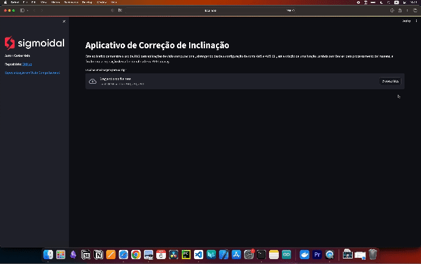

# Image Processing API with AWS

This guide provides step-by-step instructions on how to create and configure an image processing API using AWS API Gateway and Lambda with Python.



## Prerequisites

Before you begin, make sure you have everything you need:

- **Pyenv** - A tool for managing multiple versions of Python. The recommended version of Python for this project is `3.11.3`. To install Pyenv, follow the [Official Pyenv Installation Instructions](https://github.com/pyenv/pyenv#installation).

- **Poetry** - A Python dependency management tool. To install Poetry, follow the [Official Poetry Installation Instructions](https://python-poetry.org/docs/#installation).

- **Docker** - Required for creating an isolated environment that simulates a Lambda function for local testing. To install Docker, follow the instructions at [Install Docker](https://docs.docker.com/). After installation, you can verify if Docker is running with the command `docker ps`.

## Installation and Configuration

Here are the steps you need to follow to set up your development environment:

1. Clone the [Github Repository](https://github.com/carlosfab/image-processing-api) on the `versao-portugues` branch to your local machine and access the `image-processing-api` folder:

   ```bash
   git clone -b versao-portugues https://github.com/carlosfab/image-processing-api.git
   cd image-processing-api
   ```

2. Configure Poetry to create virtual environments within the project directory.

   ```bash
   poetry config virtualenvs.in-project true
   ```

3. Set up the `3.11.3` version of Python with Pyenv:

   ```bash
   pyenv install 3.11.3
   pyenv local 3.11.3
   ```

4. Install project dependencies:

   ```bash
   poetry install
   ```

5. Activate the virtual environment.

   ```bash
   poetry shell
   ```

## Configuring AWS

If you do not already have an AWS account, create an AWS account to be able to use AWS API Gateway and Lambda services. Install and Configure AWS CLI, The AWS CLI is a command-line tool for managing AWS services. Follow the [official instructions to install the AWS CLI](https://docs.aws.amazon.com/cli/latest/userguide/getting-started-install.html).

After installation, [configure the AWS CLI with your credentials](https://docs.aws.amazon.com/cli/latest/userguide/cli-configure-files.html) by running:

```bash
aws configure
```

After configuring the AWS CLI, you can obtain your AWS account ID by running the following command:

```bash
aws sts get-caller-identity --query Account --output text
```

This command returns your AWS account ID, which is useful for various operations on AWS
